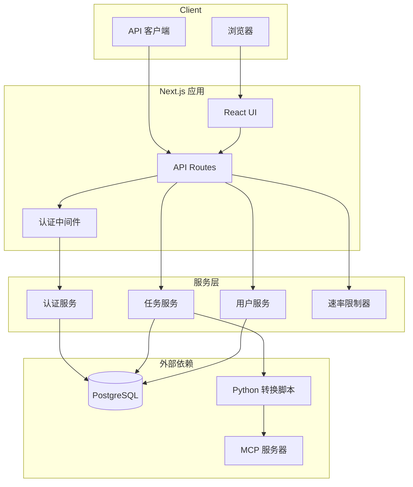
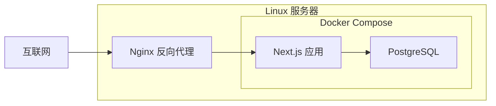

# 设计文档

## 概述

xyb-article-service 是一个基于 Next.js App Router 的全栈 Web 应用，提供微信公众号文章转换服务。系统采用分层架构，前端使用 React + shadcn/ui，后端通过 API Routes 暴露 RESTful 接口，数据存储使用 PostgreSQL，文章转换通过子进程调用现有 Python 技能。 支持edgeone，vercel部署。

## 架构



### 技术栈

| 层级 | 技术选型 |
|------|---------|
| 前端框架 | Next.js 15 App Router |
| UI 组件 | React 19, shadcn/ui, Tailwind CSS |
| 状态管理 | React Context + SWR |
| 后端运行时 | Node.js 20+ TypeScript |
| 数据库 | PostgreSQL 15+ |
| ORM | Prisma |
| 认证 | JWT (jose 库) |
| 密码哈希 | bcrypt |
| 进程管理 | Node.js child_process |
| 容器化 | Docker, Docker Compose |

## 组件与接口

### 目录结构

```
xyb-article-service/
├── src/
│   ├── app/
│   │   ├── (auth)/           # 认证相关页面
│   │   │   ├── login/
│   │   │   └── register/
│   │   ├── (dashboard)/      # 主应用页面
│   │   │   ├── jobs/
│   │   │   ├── api-keys/
│   │   │   └── settings/
│   │   ├── admin/            # 管理员页面
│   │   │   ├── users/
│   │   │   └── stats/
│   │   ├── api/              # API Routes
│   │   │   ├── auth/
│   │   │   ├── jobs/
│   │   │   ├── api-keys/
│   │   │   └── admin/
│   │   ├── layout.tsx
│   │   ├── page.tsx
│   │   └── globals.css
│   ├── components/
│   │   ├── ui/               # shadcn/ui 组件
│   │   ├── auth/             # 认证相关组件
│   │   ├── jobs/             # 任务相关组件
│   │   └── layout/           # 布局组件
│   ├── lib/
│   │   ├── auth/             # 认证逻辑
│   │   ├── db/               # 数据库操作
│   │   ├── rate-limiter/     # 速率限制
│   │   ├── converter/        # Python 调用封装
│   │   └── validators/       # 输入验证
│   └── types/                # TypeScript 类型定义
├── prisma/
│   └── schema.prisma
├── python-skill/             # Python 技能软链接或复制
├── Dockerfile
├── docker-compose.yml
├── .env.example
└── package.json
```

### API 接口设计

#### 认证接口

```
POST   /api/auth/register     - 用户注册
POST   /api/auth/login        - 用户登录
POST   /api/auth/logout       - 用户登出
GET    /api/auth/me           - 获取当前用户信息
```

#### 任务接口

```
GET    /api/jobs              - 获取任务列表（分页）
POST   /api/jobs              - 创建新任务
GET    /api/jobs/:id          - 获取任务详情
DELETE /api/jobs/:id          - 删除任务
GET    /api/jobs/:id/download - 下载任务结果
```

#### API Key 接口

```
GET    /api/api-keys          - 获取 API Key 列表
POST   /api/api-keys          - 创建新 API Key
DELETE /api/api-keys/:id      - 删除 API Key
```

#### 管理员接口

```
GET    /api/admin/users       - 获取用户列表
PATCH  /api/admin/users/:id   - 更新用户状态
GET    /api/admin/stats       - 获取系统统计
GET    /api/admin/health      - 获取系统健康状态
```

### 核心类型定义

```typescript
// 用户
interface User {
  id: string;
  email: string;
  passwordHash: string;
  role: 'user' | 'admin';
  status: 'active' | 'disabled';
  createdAt: Date;
  updatedAt: Date;
}

// API Key
interface ApiKey {
  id: string;
  userId: string;
  keyPrefix: string;       // 前8字符用于显示
  keyHash: string;         // 完整 Key 的哈希
  name: string;
  createdAt: Date;
  lastUsedAt: Date | null;
}

// 任务
interface Job {
  id: string;
  userId: string;
  sourceUrl: string;
  templateFamily: 'template1' | 'template2' | 'template3';
  colorStyle: 'morandi_purple' | 'morandi_green' | 'raw_original';
  rewriteInstructions: string | null;
  status: 'pending' | 'processing' | 'success' | 'failed';
  resultPath: string | null;
  errorMessage: string | null;
  title: string | null;
  createdAt: Date;
  completedAt: Date | null;
}
```

## 数据模型

### Prisma Schema

```prisma
model User {
  id            String    @id @default(cuid())
  email         String    @unique
  passwordHash  String
  role          Role      @default(USER)
  status        Status    @default(ACTIVE)
  createdAt     DateTime  @default(now())
  updatedAt     DateTime  @updatedAt
  
  apiKeys       ApiKey[]
  jobs          Job[]
  
  @@map("users")
}

model ApiKey {
  id          String    @id @default(cuid())
  userId      String
  keyPrefix   String    @db.Char(8)
  keyHash     String    @unique
  name        String
  createdAt   DateTime  @default(now())
  lastUsedAt  DateTime?
  
  user        User      @relation(fields: [userId], references: [id], onDelete: Cascade)
  
  @@map("api_keys")
}

model Job {
  id                 String      @id @default(cuid())
  userId             String
  sourceUrl          String
  templateFamily     String
  colorStyle         String
  rewriteInstructions String?
  status             JobStatus   @default(PENDING)
  resultPath         String?
  errorMessage       String?
  title              String?
  createdAt          DateTime    @default(now())
  completedAt        DateTime?
  
  user               User        @relation(fields: [userId], references: [id], onDelete: Cascade)
  
  @@index([userId])
  @@index([status])
  @@map("jobs")
}

enum Role {
  USER
  ADMIN
}

enum Status {
  ACTIVE
  DISABLED
}

enum JobStatus {
  PENDING
  PROCESSING
  SUCCESS
  FAILED
}
```

## 正确性属性

*属性是系统在所有有效执行中应保持的特征或行为——本质上，是关于系统应该做什么的形式化陈述。属性作为人类可读规范与机器可验证正确性保证之间的桥梁。*

本系统主要涉及 Web 服务和数据库操作，核心业务逻辑（文章转换）委托给外部 Python 进程。以下属性适用于可进行属性测试的纯函数部分。

### 属性 1: URL 验证一致性

*对于任意*字符串，当且仅当该字符串是有效的 `https://mp.weixin.qq.com/` 开头的 URL 时，验证函数 SHALL 返回 true。

**验证: 需求 1.1, 3.4, 3.5**

### 属性 2: 密码强度验证

*对于任意*密码字符串，当且仅当密码长度至少 8 位且同时包含字母和数字时，验证函数 SHALL 返回 true。

**验证: 需求 2.3**

### 属性 3: 密码哈希可验证

*对于任意*密码字符串，使用 bcrypt 哈希后生成的哈希值 SHALL 能够通过验证函数正确验证原始密码。

**验证: 需求 2.5**

### 属性 4: JWT Token 签名验证

*对于任意* JWT Token，使用生成该 Token 的密钥验证 SHALL 成功，使用其他密钥验证 SHALL 失败。

**验证: 需求 2.8**

### 属性 5: 输入消毒

*对于任意*包含 HTML/JavaScript 标签的输入字符串，消毒函数 SHALL 移除所有标签并返回纯文本内容。

**验证: 需求 3.6**

### 属性 6: API Key 格式

*对于任意*生成的 API Key，SHALL 符合 `xyb_` 前缀 + 32 字符十六进制字符串的格式，且前缀与完整 Key 的哈希 SHALL 正确对应。

**验证: 需求 4.1**

## 错误处理

### 错误类型

| 错误类型 | HTTP 状态码 | 场景 |
|---------|-----------|------|
| ValidationError | 400 | 输入参数验证失败 |
| AuthenticationError | 401 | 未登录或 Token 无效 |
| AuthorizationError | 403 | 权限不足 |
| NotFoundError | 404 | 资源不存在 |
| ConflictError | 409 | 资源冲突（如邮箱已注册） |
| RateLimitError | 429 | 请求频率超限 |
| InternalError | 500 | 内部服务器错误 |

### 错误响应格式

```typescript
interface ErrorResponse {
  error: {
    code: string;
    message: string;
    details?: Record<string, unknown>;
  };
}
```

### 任务失败处理

1. Python 子进程超时（120秒）时终止进程并标记任务失败
2. MCP 服务不可用时返回错误信息
3. 文章解析失败时记录具体错误原因

## 测试策略

### 双重测试方法

- **单元测试**: 验证特定场景、边界条件和错误处理
- **属性测试**: 验证纯函数在所有输入下的通用属性
- **集成测试**: 验证组件间交互、数据库操作、外部服务调用

### 单元测试重点

单元测试应聚焦于：
- 认证服务的边界条件（空密码、超长邮箱等）
- 速率限制器的计数逻辑
- API Key 验证的各种失败情况
- 错误处理和异常捕获

### 属性测试配置

使用 fast-check 库进行属性测试：
- 每个属性测试最少运行 100 次
- 每个属性测试必须引用设计文档中的属性编号
- 标签格式: **Feature: xyb-article-service, Property N: {property_text}**

### 属性测试实现

| 属性编号 | 测试内容 | 测试方法 |
|---------|---------|---------|
| Property 1 | URL 验证 | 生成随机字符串，验证只有合法微信 URL 通过 |
| Property 2 | 密码强度 | 生成随机字符串，验证规则一致性 |
| Property 3 | 密码哈希 | 生成随机密码，验证哈希后可还原验证 |
| Property 4 | JWT 验证 | 生成随机 Token 和密钥，验证签名逻辑 |
| Property 5 | 输入消毒 | 生成包含 XSS 载荷的字符串，验证全部被清除 |
| Property 6 | API Key 格式 | 调用生成函数，验证输出格式 |

### 集成测试重点

集成测试覆盖：
- 数据库 CRUD 操作（Prisma 层）
- API 端点完整流程
- 认证流程（注册 → 登录 → 访问受保护资源）
- 任务流程（创建 → 查询 → 下载）
- Python 子进程调用（使用 Mock MCP 响应）

### 端到端测试

使用 Playwright 或类似工具测试：
1. 用户注册新账户
2. 登录系统
3. 创建文章转换任务
4. 等待任务完成
5. 下载结果文件
6. 验证文件内容

### Python 技能集成

由于文章转换依赖外部 Python 脚本和 MCP 服务：
- 开发环境：使用 Mock MCP 响应进行本地测试
- CI 环境：使用录制响应或跳过真实网络调用
- 生产验证：使用少量真实 URL 进行冒烟测试

## 安全设计

### 密码存储

- 使用 bcrypt 进行密码哈希
- 盐值轮数：12（默认）

### JWT 配置

- 算法：HS256
- 有效期：7 天
- 存储：HttpOnly Cookie
- 刷新：不提供刷新机制，Token 过期后重新登录

### API Key

- 格式：`xyb_` + 32 字符十六进制（共 37 字符）
- 存储：仅存储哈希值和前 8 字符前缀
- 展示：创建时展示一次完整 Key，之后仅展示前缀

### 速率限制

| 限制类型 | 阈值 | 时间窗口 |
|---------|-----|---------|
| 全局 IP | 60 次 | 1 分钟 |
| 用户级 | 30 次 | 1 分钟 |
| API Key 级 | 30 次 | 1 分钟 |

实现方式：使用内存存储（单实例）或 Redis（多实例）

### 输入验证

- URL 验证：仅接受 `https://mp.weixin.qq.com/` 开头的链接
- 重写指令：限制最大长度 2000 字符，过滤 HTML 标签
- 模板参数：枚举值验证，拒绝非法值

## 部署架构



### Docker Compose 配置

```yaml
services:
  app:
    build: .
    ports:
      - "3000:3000"
    environment:
      - DATABASE_URL=postgresql://user:pass@db:5432/xyb_article
      - JWT_SECRET=${JWT_SECRET}
    depends_on:
      - db
    volumes:
      - ./output:/app/output
      
  db:
    image: postgres:15-alpine
    environment:
      - POSTGRES_USER=user
      - POSTGRES_PASSWORD=pass
      - POSTGRES_DB=xyb_article
    volumes:
      - pgdata:/var/lib/postgresql/data

volumes:
  pgdata:
```

### 环境变量

| 变量名 | 说明 | 默认值 |
|-------|------|-------|
| DATABASE_URL | PostgreSQL 连接串 | - |
| JWT_SECRET | JWT 签名密钥 | - |
| PYTHON_SKILL_PATH | Python 技能路径 | ~/.agents/skills/xyb-wechat-article-transcription |
| MCP_URL | MCP 服务端点 | https://changfengbox.top/api/mcp |
| MAX_JOBS_PER_USER | 用户最大任务数 | 1000 |
| JOB_RETENTION_DAYS | 任务保留天数 | 30 |
